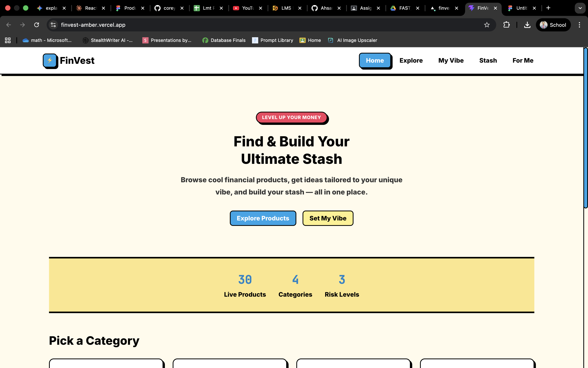
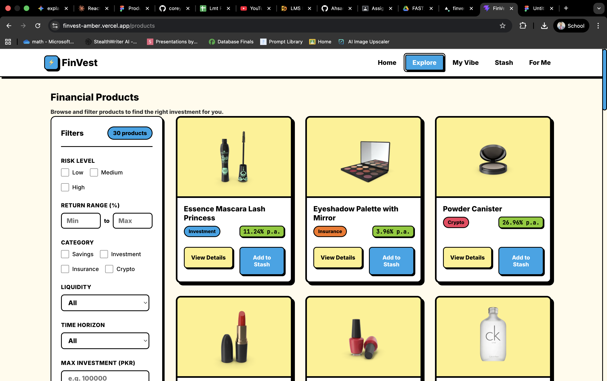
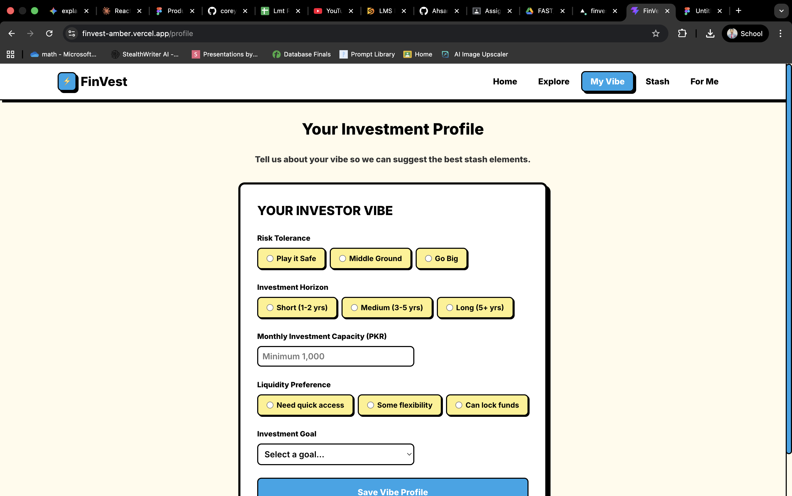
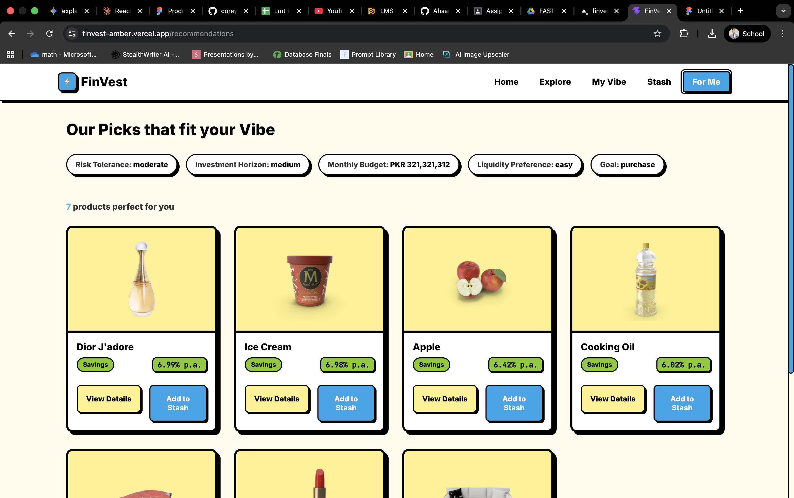
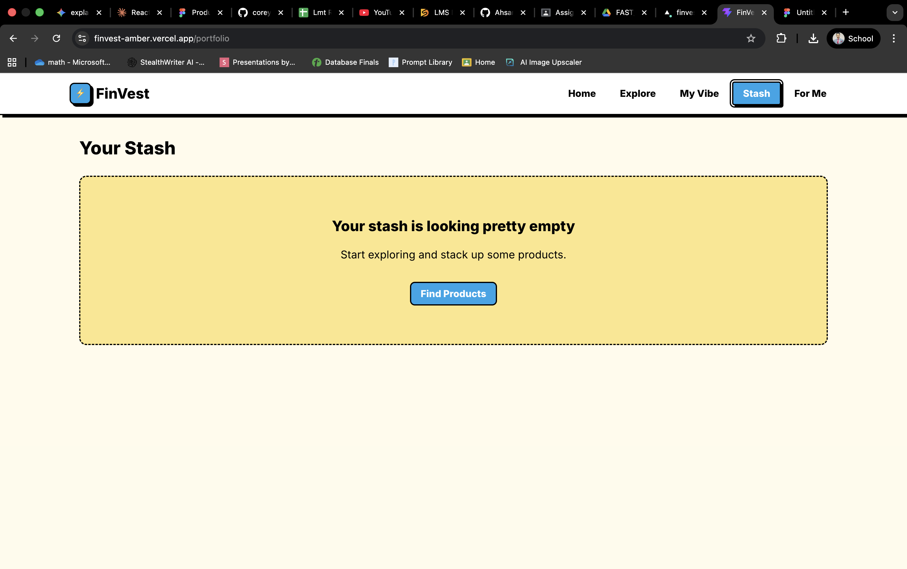

<div align="center">

# FinVest

### A Financial Product Discovery Platform

[](https://react.dev/)
[](https://vitejs.dev/)
[](https://finvest-amber.vercel.app/)
[](./LICENSE)

**Browse financial products. Build your investor profile. Grow your stash.**

[Live Demo](https://finvest-amber.vercel.app/) · [Report a Bug](https://github.com/Ahsan-Shah056/Finvest/issues) · [Request a Feature](https://github.com/Ahsan-Shah056/Finvest/issues)

</div>

---

## What Is FinVest?

Most investment platforms assume you already know what you want. FinVest does not.

It takes real product data from an external API, transforms it into financial instruments with genuine risk levels, expected returns, and liquidity classifications, and then uses your personal investor profile to surface products that actually match your situation. Everything happens in one place: browse, set your vibe, get recommendations, and build your stash.

No prior investment knowledge required.

---

## Screenshots

<table>
  <tr>
    <td align="center" width="50%">
      
      <br/>
      <sub><b>Home</b> — The landing page with stats and category navigation</sub>
    </td>
    <td align="center" width="50%">
      
      <br/>
      <sub><b>Explore</b> — 30 products with live multi-criteria filtering</sub>
    </td>
  </tr>
  <tr>
    <td align="center" width="50%">
      
      <br/>
      <sub><b>My Vibe</b> — Set your risk tolerance, budget, and investment goals</sub>
    </td>
    <td align="center" width="50%">
      
      <br/>
      <sub><b>For Me</b> — Personalized product picks based on your profile</sub>
    </td>
  </tr>
  <tr>
    <td align="center" colspan="2">
      
      <br/>
      <sub><b>Stash</b> — Manage allocations and track your portfolio metrics live</sub>
    </td>
  </tr>
</table>

---

## Features

| Feature                      | What it does                                                                                              |
| ---------------------------- | --------------------------------------------------------------------------------------------------------- |
| **Dynamic Catalog**          | 30 products fetched from DummyJSON, transformed into financial instruments on every load                  |
| **Multi-Criteria Filtering** | Filter by risk level, return range, category, liquidity, time horizon, and max investment simultaneously  |
| **Investor Profile**         | Five-field form: risk tolerance, time horizon, monthly budget, liquidity preference, and investment goal  |
| **Recommendation Engine**    | Four-pass filter algorithm that matches your profile to suitable products, then sorts by return           |
| **Live Portfolio Metrics**   | Total invested, weighted average return, and risk distribution update instantly as you adjust allocations |
| **Deterministic Data**       | A seeded function ensures every product shows the same financial attributes on every page refresh         |

---

## Tech Stack

| Layer            | Technology                             |
| ---------------- | -------------------------------------- |
| Framework        | React 19                               |
| Build Tool       | Vite 8                                 |
| Routing          | React Router DOM v7                    |
| State Management | Context API with `useMemo`             |
| Styling          | Vanilla CSS with CSS custom properties |
| Notifications    | react-hot-toast                        |
| Analytics        | Vercel Analytics                       |
| Data Source      | DummyJSON REST API                     |
| Deployment       | Vercel                                 |

---

## Getting Started

### Prerequisites

- Node.js 18 or later
- npm 9 or later

### Installation

**1. Clone the repository**

```bash
git clone https://github.com/Ahsan-Shah056/Finvest.git
cd Finvest
```

**2. Install dependencies**

```bash
npm install
```

**3. Start the development server**

```bash
npm run dev
```

The app will be live at `http://localhost:5173`.

### Build for Production

```bash
npm run build
```

The output lands in the `dist/` folder, ready to deploy.

---

## Project Structure

```
src/
├── components/
│   ├── FilterPanel.jsx       # Stateless filter controls
│   ├── Navbar.jsx            # Top navigation
│   ├── ProductCard.jsx       # Individual product display + stash action
│   ├── PortfolioItem.jsx     # Stash item with editable allocation
│   ├── PortfolioSummary.jsx  # Live portfolio metrics display
│   ├── RecommendationList.jsx
│   ├── ReturnDisplay.jsx
│   └── RiskBadge.jsx
├── contexts/
│   ├── PortfolioContext.jsx  # Global stash state and live stats
│   └── UserProfileContext.jsx # Global investor profile state
├── pages/
│   ├── Home.jsx
│   ├── Products.jsx          # Product listing with filter logic
│   ├── ProductDetail.jsx
│   ├── Profile.jsx           # Investor profile form
│   ├── Portfolio.jsx         # Stash management
│   ├── Recommendations.jsx   # Algorithm output
│   └── NotFound.jsx
├── utils/
│   ├── transformData.js      # API-to-financial-instrument pipeline
│   ├── portfolioCalc.js      # Weighted return and risk distribution math
│   └── recommendations.js    # Filter and sort logic
├── styles/                   # Per-component CSS files
└── App.jsx                   # Root: data fetching, routing, context setup
```

---

## Component Architecture

The diagram below shows the full component hierarchy and where data flows from parent to child via props versus directly through Context.


### Key Design Decisions

**`App`** owns all data fetching and passes `products`, `loading`, and `error` down to pages that need them. It also wraps the entire application in both context providers.

**`Products`** derives its visible list inline during render from raw filter state. No `useEffect` is used for this. The filter values live in state; the filtered list is computed directly on every render from those values. This avoids the stale-data issues that come from storing derived state separately.

**`Portfolio`** takes zero props from `App`. It reads everything from `PortfolioContext` directly, keeping it fully decoupled from the component tree above it.

---

## Financial Logic

### How Product Data Is Built

The DummyJSON API returns ordinary retail products. Every product goes through a transformation pipeline before the app shows it to the user:

```
Raw product (DummyJSON)
       |
       v
  id % 4  ──>  financial category  (savings / investment / insurance / crypto)
       |
       v
  RISK_MAP  ──>  risk level  (low / medium / high)
       |
       v
  seededValue(id)  ──>  scaled into return band  ──>  expectedReturn
       |
       v
  price * 1000  ──>  minInvestment  (PKR)
```

The seeded function uses `Math.sin(id * 9301 + 49297) % 1` to produce a stable decimal for any product ID. The same ID always produces the same number, so the financial data never changes between page loads.

See the full pipeline diagram:


---

### Risk and Return Bands

| Risk Level | Expected Return | Categories         |
| ---------- | --------------- | ------------------ |
| Low        | 3% to 7% p.a.   | Savings, Insurance |
| Medium     | 7% to 12% p.a.  | Investment         |
| High       | 12% to 27% p.a. | Crypto             |

---

### Recommendation Algorithm

The engine takes the saved profile and the full product list, then runs four sequential filters:

```
All products
    │
    ▼
[1] Budget check          ── drop anything above monthlyCapacity
    │
    ▼
[2] Risk filter           ── conservative → [low]
                             moderate     → [low, medium]
                             aggressive   → [low, medium, high]
    │
    ▼
[3] Time horizon filter   ── short  → [short]
                             medium → [short, medium]
                             long   → [short, medium, long]
    │
    ▼
[4] Liquidity filter      ── easy   → [easy]
                             moderate → [easy, moderate]
                             locked → [easy, moderate, locked]
    │
    ▼
Sort by expectedReturn
    (ascending for conservative, descending for all others)
    │
    ▼
Recommended products
```

See the full flowchart:


---

### Portfolio Calculations

All three metrics recalculate the moment any allocation changes, via `useMemo` inside `PortfolioContext`.

**Total Invested**

```
totalInvested = sum of all allocatedAmount values
```

**Weighted Return**

```
weightedReturn = sum of (allocatedAmount / totalInvested) * expectedReturn
                 for each item in the portfolio
```

**Risk Distribution**

```
riskDistribution.low    = (sum of low-risk allocations / totalInvested) * 100
riskDistribution.medium = (sum of medium-risk allocations / totalInvested) * 100
riskDistribution.high   = (sum of high-risk allocations / totalInvested) * 100
```

See the state lifecycle diagram:


---

## State Management

```
App (data fetching: products, loading, error)
 │
 ├── PortfolioContext  (global stash: items, stats, add/remove/update)
 │       └── accessible via usePortfolio() in any component
 │
 └── UserProfileContext  (global profile: riskTolerance, horizon, budget, ...)
         └── accessible via useUserProfile() in any component
```

Local `useState` is used only for UI state that belongs to a single component: form field values in the Profile page, filter selections in the Products page, and the `loading` / `error` flags in App.

---

## Deployment

The app is deployed on Vercel at [finvest-amber.vercel.app](https://finvest-amber.vercel.app/).

To deploy your own fork:

```bash
npm install -g vercel
vercel --prod
```

Vercel auto-detects the Vite config and handles the build.

---

## Author

**Muhammad Ahsan**
23i-5010 | FAST National University

---
